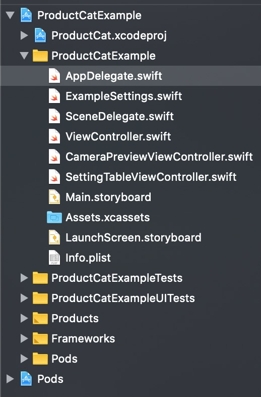

# ProductCat Swift SDK and Demo Source Code


---

## Table of Contents
 1. [Overview](#1-overview)
 2. [Setup](#2-setup)
      - 2.1 [Run the Demo](#21-run-the-demo)
      - 2.2 [Set up Xcode Project](#22-set-up-xcode-project)
      - 2.3 [Import ProductCat SDK](#23-import-visearch-swift-sdk)
      - 2.4 [Add Privacy Usage Description](#24-add-privacy-usage-description)
 3. [Initialization](#3-initialization)
 4. [Solution APIs](#4-solution-apis)
    - 4.1 [Search by Image](#41-search-by-image)
	    - 4.1.1 [Selection Box](#411-selection-box)
	    - 4.1.2 [Resizing Settings](#412-resizing-settings)
    - 4.2 [Search Results API](#42-search-results-api)
    - 4.3 [Text Search](#43-text-search)
 5. [Search Results](#5-search-results)
 6. [Data Privacy Flow](#6-data-privacy-flow)
 

---


## 1. Overview

Our ProductCat (Products Catalog) API enables you to find and search for products more easily by cataloguing your products automatically.[ProductCat API Documentation](https://developers.visenze.com/api/#productcat-api).

This SDK is an open source software to provide easy integration of ProductCat Search APIs with your iOS applications. It provides three search methods - Search Product by Image, Search Product by text keywords and Get Search Results Page. 

ProductCat database is partitioned globally based on `country` and geographical regions. It is required that you call the Product Search APIs with `country` parameter to ensure only products that ship to the country will be returned.

> Current stable version: `0.2.0` (Swift 5+)
> 

> Supported iOS version: iOS 10.x and higher


## 2. Setup

### 2.1 Run the Demo

The source code of a demo application is provided together with the SDK ([demo](https://github.com/visenze/productcat-sdk-ios/tree/master/ProductCatExample)). You can simply open **ProductCatExample.xcworkspace** in Xcode and run the demo.



You will need to initialize the ProductCat client in AppDelegate file by using your app key.

```swift

// TODO: fill in your app key and search country here
ProductCat.sharedInstance.setup(appKey: "YOUR_APP_KEY", country: ExampleSettings.getCountry() ?? "SG")
       
       
```

### 2.2 Set up Xcode project

### 2.3 Import ProductCat Swift SDK

#### 2.3.1 Using CocoaPods

First you need to install the CocoaPods Ruby gem:

```
sudo gem install cocoapods --pre
```

Then go to your project directory to create an empty Podfile
```
cd /path/to/Demo
pod init
```

Edit the Podfile as follow:
```
platform :ios, '10.0'
use_frameworks!

target '<Your Target Name>' do
    pod 'ProductCat'
end
...
```

Install the SDK:

```
pod install
```
The Demo.xcworkspace project should be created.

#### 2.3.2 Using Manual Approach

You can also download the iOS [SDK](https://github.com/visenze/productcat-sdk-ios/archive/master.zip) directly. To use it, unzip it and drag ProductCat project into your project.

- Open the `ProductCat` folder, and drag the `ProductCat` into the Project Navigator of your application's Xcode project.

    > It should appear nested underneath your application's blue project icon. Whether it is above or below all the other Xcode groups does not matter.

- Select the `ProductCat.xcodeproj` in the Project Navigator and verify the deployment target matches that of your application target.
- Next, select your application project in the Project Navigator to navigate to the target configuration window and select the application target under the "Targets" heading in the sidebar.
- In the tab bar at the top of that window, open the "Build Phases" panel.
- Click on the `+` button under the "Link Binary with Libraries" section.
- Select the `ProductCat.framework`.
- You will also need to click on `+` button to add 'New Copy Files Phase' > set 'Frameworks' as Destination and ProductCat.framework to copy the framework into your project.

> The `ProductCat.framework` is then registered as a target dependency, linked framework and embedded framework.

You are done!

### 2.4 Add Privacy Usage Description

iOS 10+ requires user permission to access camera and photo library. If your app requires these access, please add description for NSCameraUsageDescription, NSPhotoLibraryUsageDescription in the Info.plist. More details can be found [here](https://developer.apple.com/library/content/documentation/General/Reference/InfoPlistKeyReference/Articles/CocoaKeys.html#//apple_ref/doc/uid/TP40009251-SW24).

## 3. Initialization
`ProductCat` client **must** be initialized with an `app_key` **before** it can be used.

```swift
import ProductCat

...
// using default client which will connect to Visenze's server
// the country is passed to select the corresponding search points
// We provided 2 different points for China and the rest of the world
// productcat.visenze.com and productcat.visenze.com.cn
ProductCat.sharedInstance.setup(appKey: "YOUR_APP_KEY", country: "SG")
        
// specify custom timeout
ProductCat.sharedInstance.setup(baseUrl: "https://productcat.visenze.com", appKey: "YOUR_APP_KEY", country: "SG", timeout:20 )

...
```

## 4. Solution APIs

### 4.1 Search by Image

POST /summary/products

**Search by image** solution is to search for visually similar products in the global products database given a query image. You should construct the `UIImage` object and pass it to `ImageSearchParams` to start a search. Please also specify the `country` parameter to define which local database you want to search.

* Using  Image

```swift
import ProductCat
...

let image = UIImage(named: "someImage.png")
let params = ImageSearchParams(country: "SG", image: image!)

ProductCat.sharedInstance.imageSearch(params: params,
                    successHandler: {
                        (data : ProductSummaryResponse?) -> Void in
                        // Do something when request succeeds
                        // preview by calling : dump(data)
                        // check data.hasError and data.error for any errors return by ViSenze server
                    },
                    failureHandler: {
                        (err) -> Void in
                        // Do something when request fails e.g. due to network error
                        print ("error: \\(err.localizedDescription)")
					})

```

* Alternatively, you can pass an image url directly to `ImageSearchParams` to start the search :

```swift
import ProductCat
...

let params = ImageSearchParams(country: "SG", imUrl: "http://somesite.com/sample_image.png")
        
...
```

* If you are performing refinement on a previously uploaded image such as resizing the box, you can pass the `im_id` returned in the search result to start the search instead of uploading the image again. 

```swift
import ProductCat
...

let params = ImageSearchParams(country: "SG", imId: "visenze_image_id_returned in previous search")
        
...
```

#### 4.1.1 Selection Box

If the object you wish to search for takes up only a small portion of your image, or other irrelevant objects exist in the same image, chances are the search result could become inaccurate. Use the Box parameter to refine the search area of the image to improve accuracy. The box coordinated is set with respect to the original size of the uploading image. Note: the coordinate system uses pixel as unit instead of point.

```swift
// create the box to refine the area on the searching image
// Box(x1, y1, x2, y2) where (0,0) is the top-left corner
// of the image, (x1, y1) is the top-left corner of the box,
// and (x2, y2) is the bottom-right corner of the box.
...

let params = ImageSearchParams(.....)

let box = Box(x1: 0, y1: 0, x2: 100, y2: 100)
params.box = box
        
// start searching
...
```

#### 4.1.2 Resizing Settings

When performing image search, you may notice the increased search latency with increased image file size. This is due to the increased time spent in network transferring your images to ViSenze server, and the increased time for processing larger image files.

To reduce upload search latency, by default the method makes a copy of your image file and resizes the copy to 512x512 pixels if one of the original dimensions exceed 512 pixels. This is the optimized size to lower search latency while not sacrificing search accuracy for general use cases:

```swift
// by default, the max width of the image is set to 512px, quality is 0.97
let params = ImageSearchParams(.....)

// or you can explicitly set a param's settings
params?.imgSettings = ImageSettings(setting: .highQualitySetting)
        
```

If your image contains fine details such as textile patterns and textures, you can use an image with larger size for search to get better search result:

```swift
// by default, the max width of the image is set to 512px, quality is 0.97
let params = ImageSearchParams(.....)

// set the image with high quality settings.
// Max width is 1024px, and the quality is 0.985. Note: Quality with 1.0 take hugespace
params?.imgSettings = ImageSettings(setting: .highQualitySetting)

```

Or, provide the customized resize settings. To make efficient use the of the memory and network bandwidth of mobile device, the maximum size is set at 1024 x 1024. Any image exceeds the limit will be resized to the limit:

```swift
//resize the image to 800 by 800 area using jpeg 0.9 quality
params?.imgSettings = ImageSettings(size: CGSize(width: 800, height: 800), quality: 0.9)
        
```

### 4.2 Search Results API

POST /summary/products/srp

**Search Results Page API** solution is to get a web url to display the searched results in browser. All parameters used in /summary/products are also valid in this api.


```swift
import ProductCat
...

ProductCat.sharedInstance.imageSearchResultPage(params: params,
                    successHandler: {
                        (data : ProductSummaryResponse?) -> Void in
                        // Do something when request succeeds
                        // preview by calling : dump(data)
                        // check data.hasError and data.error for any errors return by ViSenze server
                        // open the search results in a browser
                        
                        if let searchResultsUrl = data.srpUrl, let url = URL(string: searchResultsUrl) {
                        let vc = SFSafariViewController(url: url, entersReaderIfAvailable: false)
               vc.delegate = self
               self.present(vc, animated: true)
                        
                        }
                        
                        
                    },
                    failureHandler: {
                        (err) -> Void in
                        // Do something when request fails e.g. due to network error
                        print ("error: \\(err.localizedDescription)")
					})

...
```

### 4.3 Text Search

GET /summary/products

**Text Search** solution is to search similar products by given text keywords.


```swift
import ProductCat
...

let textSearchParams = TextSearchParams(country: "SG", q: "some keywords")
ProductCat.sharedInstance.textSearch(params: textSearchParams,
                             successHandler: {
             (data : ProductSummaryResponse?) -> Void in
                 // Do something when request succeeds
                 // preview by calling : dump(data)
                 // check data.hasError and data.error for any errors return by ViSenze server
                 dump(data)
                 
              
                               
         },
        failureHandler: {
             (err) -> Void in
             // Do something when request fails e.g. due to network error
             print ("error: \\(err.localizedDescription)")
            
         })

```

## 5. Search Results

After a successful search request, a list of results are passed to the callback function in the form of **ProductSummaryResponse**.  You can use the following properties from the result to fulfill your own purpose.

| Name | Type | Description |
| ---- | ---- | ----------- |
|hasError|Bool|true if there are errors returned by Visenze server. |
|error|[String]| return the error messages from server if there is any. |
|result|[ProductSummary]|A list of products returned from the server.|
|reqid|String|A request id for debugging purpose
|imId|String|An image id returned in the result which represents a image just uploaded. It can be re-used to do another search on the same image again. 

Below are the properties of a **ProductSummary** represents a product.

| Name | Type | Description |
| ---- | ---- | ----------- |
|pid|String|product ID.|
|mainImage|String|image URL|
|title|String|product title|
|minPrice|String|product price|
|priceUnit|String|3 letters ISO currency code e.g. "USD"|
|productUrl|String|product URL|
|stores|[Store]|list of stores this product is sold in. Array has at least 1 store|


## 6. Data Privacy Flow

To analyze search performance and usage statistics (such as Click Through Rate, Active Users, Conversion Tracking, Retention Rate, etc), ProductCat SDK use `UIDevice.current.identifierForVendor?.uuidString` together with `IDFA` (from `AdSupport.framework`) to uniquely identify a user. Based on user's usage statistics, Visenze will push customized seach results and advertising products according to user's preference.  

Please note that end-users need to:

- Accept Visenze'ss Privacy Policy & Terms of Use in order to use our service
- (Optionally) Accept advertisement terms to receive special offers, promotions information and product recommendations

ProductCat SDK will show user the "Terms and Conditions" dialog for the first time usage. Users need to accept the terms and conditions before using the APIs. If users do not accept the terms, the SDK will throw an error in its callback, it is up to the developer on whether to show up the consent form again or quit the service.

```

// error will be shown via failureHandler callback (ProductCatError.TERMS_NOT_ACCEPTED)

ProductCat.sharedInstance.imageSearch(params: params,
                    successHandler: {
                        
                    },
                    failureHandler: {
                        (err) -> Void in
                        
                        if (err == ProductCatError. ProductCatError.TERMS_NOT_ACCEPTED) {
                        
                        // show terms again
                        ProductCat.sharedInstance.showConsentForm(nil)
                        
                        }
					})


```

You can show the consent form and check whether user has accepted ViSenze terms using the following methods:

```
// show the form
ProductCat.sharedInstance.showConsentForm()

// check if user accept or reject the terms
ProductCat.sharedInstance.isAcceptedVisenzeTerms()
                                               
                        
```


